# Отчет

## Part 1. Установка ОС

- Версия ОС. Вывод команды `cat /etc/issue`:

	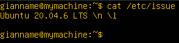 
---
## Part 2. Создание пользователя
- Добавление пользователя в группу adm. Вывод команды `sudo useradd -G adm s21_user`:

	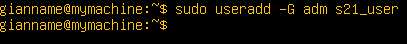
 

- Новый пользователь в выводе команды `cat /etc/passwd`:

	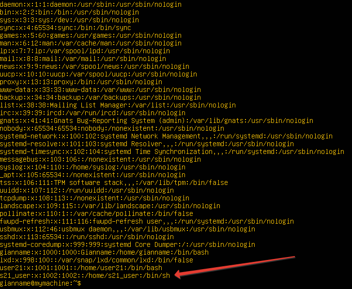
---
## Part 3. Настройка сети ОС
- Задание имени хоста `sudo hostnamectl set-hostname user-1`:

	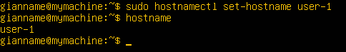	
 

- Выводим названия сетевых интерфейсов с помощью консольной команды `ip link show`:

	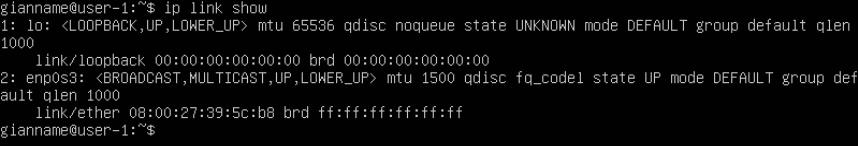
	>lo (loopback) — виртуальный сетевой интерфейс для обмена пакетами внутри хоста.
	
 

- Используя консольную команду `hostname -I`, выводим ip адрес виртуальной машины, работающей от DHCP-сервера:

	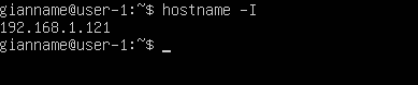
	>DHCP (Dynamic Host Configuration Protocol) — протокол, автоматически выдающий клиентам IP-конфиги (адрес, маску, шлюз, DNS)

- Получаем и выводим внешний ip-адрес шлюза (ip) и внутренний IP-адрес шлюза:

	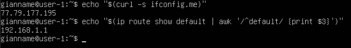
 

- Задаем статичную конфигурацию сети (ip-адрес, маску сети, IP-адрес шлюза и DNS серверов) через файл в папке `/etc/netplan`:

	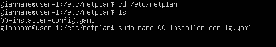
	
	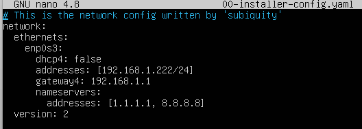
 

- Перегружаем машину и убеждаемся, что статичные настроки сохранились

	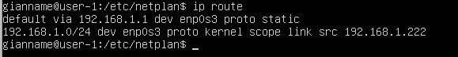
 

- Пинг хостов 1.1.1.1 и ya.ru:

	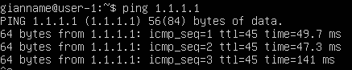
	
	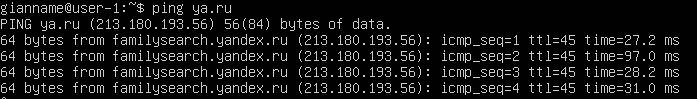
 

> ###### Краткое резюме проделанной работы:
>1. Проверил версию Ubuntu (`cat /etc/issue`) — это Ubuntu 20.04 LTS.  
>2. Создал пользователя s21_user и добавил его в группу adm (`sudo useradd -G adm s21_user`), убедился, что запись появилась в `/etc/passwd`.  
>3. Поменял имя хоста на user-1 командой `sudo hostnamectl set-hostname user-1`.  
>4. Вывел сетевые интерфейсы через `ip link show` — увидел lo и основной интерфейс enp0s3.  
>5. Узнал текущий IP машины командой `hostname -I`, например 192.168.1.121.  
>6. Определил внутренний шлюз `ip route show default` → 192.168.1.1 и внешний IP через `curl -s ifconfig.me`.  
>7. Настроил в `/etc/netplan/01-netcfg.yaml` на статический IP 192.168.1.222/24, gateway4 192.168.1.1, DNS 1.1.1.1 и 8.8.8.8, применил `sudo netplan apply`. Перезагрузил машину и подтвердил, что hostname, IP, шлюз и DNS остались статичными. Успешно пинганул хосты 1.1.1.1 и ya.ru.
---
## Part 4. Обновление ОС
- Обновление системных пакетов до последней на момент выполнения задания версии последовательностью команд `sudo apt-get update` и `sudo apt-get upgrade -y`.
 

- После обновления системных пакетов, вводим команду обновления повторно, видим сообщение о том, что обновления отсутствуют.

	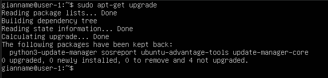
---
## Part 5. Использование команды sudo
>Команда sudo (superuser do) используется в операционных системах на базе Unix для выполнения команд с привилегиями суперпользователя или другого пользователя. Она позволяет временно повышать уровень доступа для выполнения административных задач, что обеспечивает большую безопасность, так как не нужно входить в систему под учетной записью суперпользователя.
 

- Меняем hostname ОС от имени пользователя (s21_user), созданного в пункте Part 2 (используя sudo).

	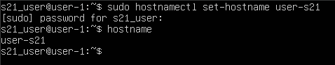
---
## Part 6. Установка и настройка службы времени
- Настраиваем службу автоматической синхронизации времени. 
Выводим время часового пояса, в котором я сейчас нахожусь. Убеждаемся, что служба синхронизации активна `NTPSynchronized=yes`:

	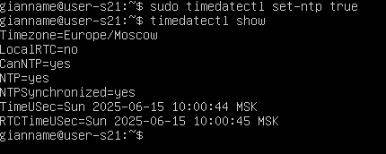 
---
## Part 7. Установка и использование текстовых редакторов
- Установим 3 текстовых редактора командой `sudo apt install vim nano mcedit -y`.
- Создаем файл с помощью VIM (`vim test_vim.txt`). Напишем в нём свой никнейм, закроем файл с сохранением изменений (Нажимаем `ESC`, вводим `:wq` и `Enter`).

	 
 

- Создаем файл с помощью NANO (`nano test_nano.txt`). Напишем в нём свой никнейм, закроем файл с сохранением изменений (вводим `Ctrl + X`, затем `Y` и `Enter`).

	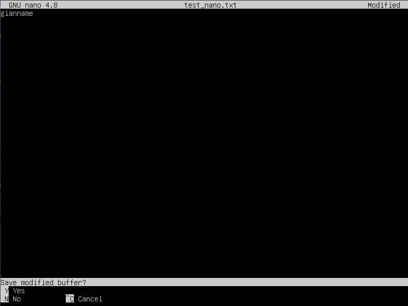 
 

- Создаем файл с помощью MCEDIT (`mcedit test_mcedit.txt`). Напишем в нём свой никнейм, закроем файл с сохранением изменений (жмем `F2`для сохранения, затем `F10` для выхода).

	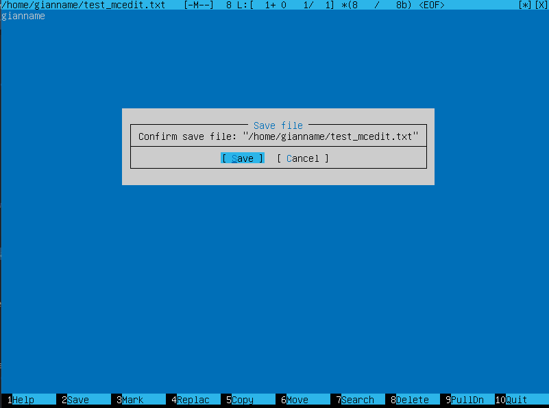 
 

- Редактируем файл с помощью VIM (`vim test_vim.txt`). Напишем в нём `21 School 21`, закроем файл без сохранения изменений (Нажимаем `ESC`, вводим `:q!` и `Enter`).

	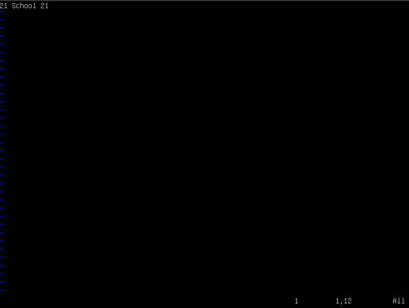 
 

- Редактируем файл с помощью NANO (`nano test_nano.txt`). Напишем в нём `21 School 21`, закроем файл без сохранения изменений (вводим `Ctrl + X`, затем `N` и `Enter`).

	 
 

- Редактируем файл с помощью MCEDIT (`mcedit test_mcedit.txt`). Напишем в нём `21 School 21`, закроем файл без сохранения изменений (жмем `F10`, соглашаемся, что выходим без сохранения, затем `Enter` для выхода).

	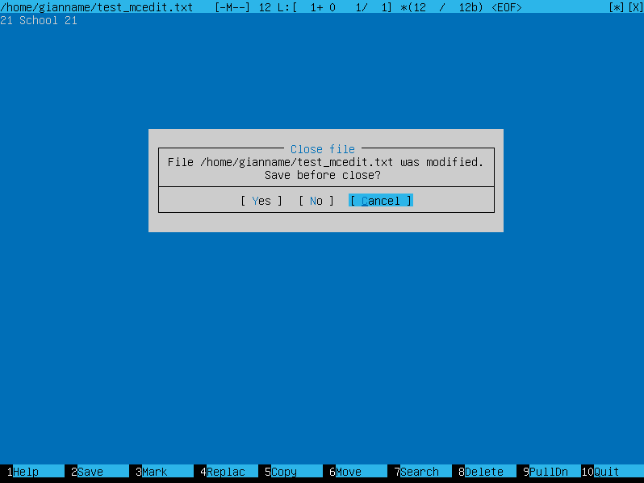 
 

- Заменим мой никнейм на слово `nackname` в файле `test_vim.txt` с помощью VIM.  В режиме ввода команд водим `:%s/gianname/nickname/g` и `Enter`.

	 
	 
 

- Заменим мой никнейм на слово `nackname` в файле `test_nano.txt` с помощью NANO.  Нажимаем комбинацию `Ctrl+\`, вводим заменяемое слово, `Enter`, вводим слово для замены, `Enter`, соглашаемся с заменой `Y(Yes)` - замена текущего вхождения или `A(All)` для замены всех вхождений.

	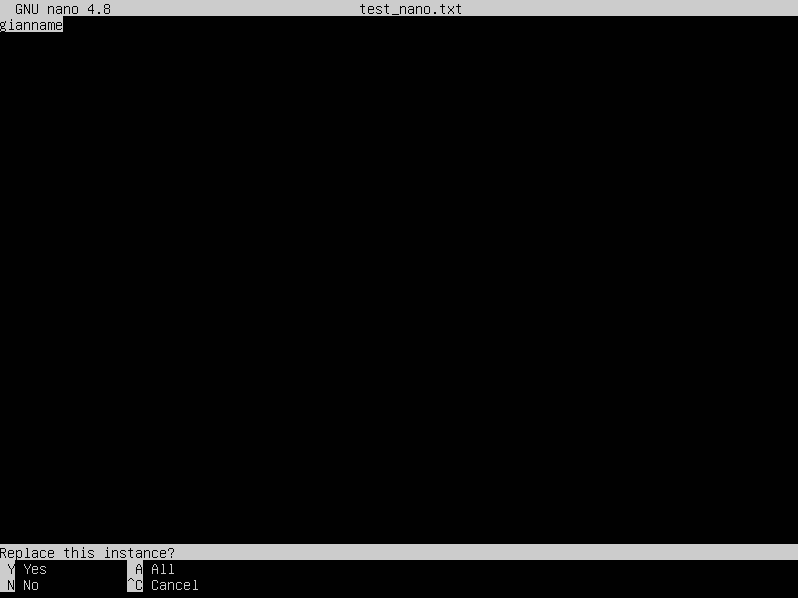 
	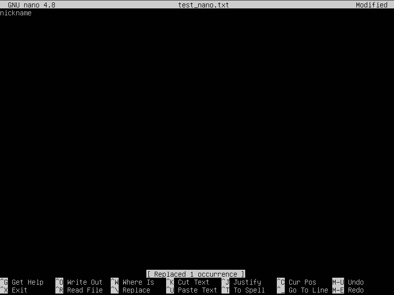 
 

- Заменим мой никнейм на слово `nackname` в файле `test_mcedit.txt` с помощью MCEDIT.  Нажимаем `F4`, вводим заменяемое слово, вводим слово для замены, нажимаем `ОК`, соглашаемся с заменой `Replace` - замена текущего вхождения или `All` для замены всех вхождений.

	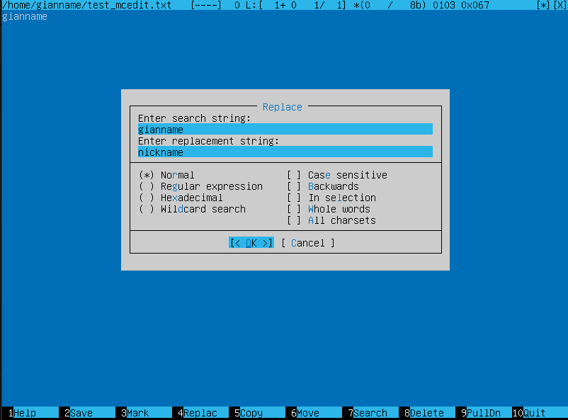 
	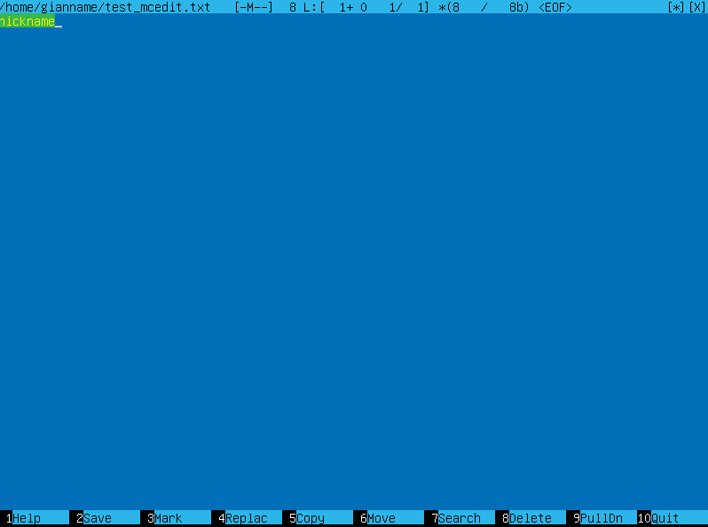 
---
## Part 8. Установка и базовая настройка сервиса SSHD
- Установиv службу SSHd.
`sudo apt-get update` 
`sudo apt-get install openssh-server`
 

- Добавим автостарт службы при загрузке системы
`sudo systemctl enable ssh`
 

-  Перенастроим службу SSHd на порт 2022:
   Отредактируем файл конфигурации: `sudo systemctl enable ssh`. Строку `#Port 22` и заменим на `Port 2022`.
 

-  Проверим наличие процесса sshd с помощью команды `ps aux | grep sshd`:

	   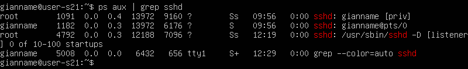
   > ###### Значение команды:
   >- `ps` — отображает информацию о текущих процессах.
   >- `aux` — комбинация ключей:
   >  - `a` — показывает процессы всех пользователей.
   >  - `u` — выводит информацию о владельце процесса.
   >  - `x` — показывает процессы, не привязанные к терминалу.
   > - `grep sshd` — фильтрует вывод, показывая только строки, содержащие "sshd".

 

-  Перегружаем систему командой `reboot`.
 

-  Проверим порт службы SSH `netstat -tan` (должна быть строка `tcp 0 0 0.0.0.0:2022 0.0.0.0:* LISTEN`):
   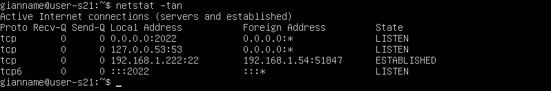
	> ###### Значение ключей `-tan`:
	> - `-t` — показывает только TCP соединения
	> - `-a` — показывает все соединения и прослушивающие порты
	> - `-n` — выводит адреса и порты в числовом формате, без попытки разрешения имен
	 

	> ###### Значение столбцов вывода:
	>   - `Proto` — протокол (TCP/UDP)
	>	- `Recv-Q` — количество байтов, ожидающих обработки
	>	- `Send-Q` — количество байтов, ожидающих отправки
	>	- `Local Address` — локальный адрес и порт
	>	- `Foreign Address` — удалённый адрес и порт
	>	- `State` — состояние соединения
		 
	> ###### Значение `0.0.0.0`:
	> - означает, что служба прослушивает на всех интерфейсах системы, что позволяет принимать соединения на этом порту с любого IP-адреса
	 

> ###### Краткое резюме проделанной работы:
>1. Выполнил обновление системных пакетов, используя команды:
	- `sudo apt-get update`
	- `sudo apt-get upgrade -y`
После выполнения команд повторно ввел команду обновления и убедился, что обновления отсутствуют. 
>2. Использование команды sudo. Cменил hostname ОС от имени пользователя s21user, используя команду sudo.
>3. Настроил службу автоматической синхронизации времени. Проверил, что служба синхронизации активна (`NTPSynchronized=yes`).
>4. Установка и использование текстовых редакторов
	Установил три текстовых редактора:
	- `sudo apt install vim nano mcedit -y`
	Создал и редактировал файлы:
	- `testvim.txt` с помощью VIM, добавив свой никнейм и затем изменив его на "21 School 21" и "nickname".
	- `testnano.txt` с помощью NANO, добавив свой никнейм и затем изменив его на "21 School 21" и "nickname".
	- `testmcedit.txt` с помощью MCEDIT, добавив свой никнейм и затем изменив его на "21 School 21" и "nickname".
>5. Установка и базовая настройка сервиса SSHD
	Установил службу SSHd с помощью команд:
	- `sudo apt-get update`
	- `sudo apt-get install openssh-server`
	Добавил автостарт службы при загрузке системы командой:
	- `sudo systemctl enable ssh`
	Перенастроил службу SSHd на порт 2022, отредактировав файл конфигурации и заменив строку `#Port 22` на `Port 2022`.
	---
## Part 9. Установка и использование утилит top, htop
- Установим утилиты top и htop командой `sudo apt install htop`
- Запустим утилиту top

	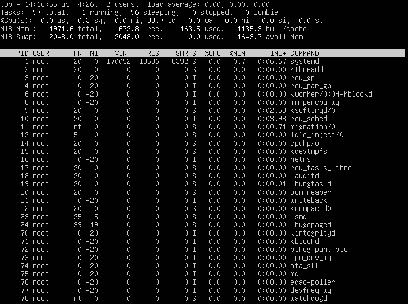
>- uptime - 4 часа 26 мин
>- количество авторизованных пользователей - 2
>- средняя загрузка системы - 0.00
>- общее количество процессов - 97
>- загрузка cpu - 0.3
>- загрузка памяти - 163.5МБ
>- pid процесса занимающего больше всего памяти - 1
>- pid процесса, занимающего больше всего процессорного времени - все 0

 

- Запустим утилиту htop.
	
	-Ввывод команды `htop` отсортированному по `PID`

	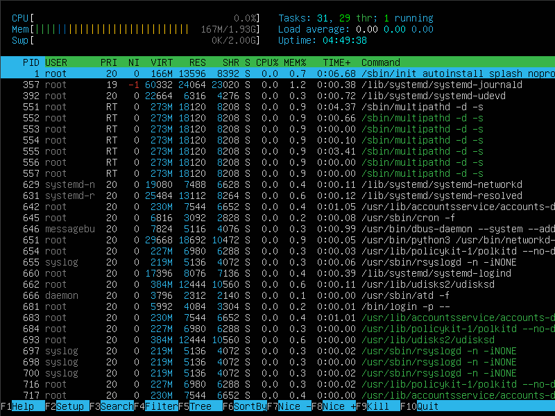

	-Ввывод команды `htop` отсортированному по `PERCENT_CPU`

	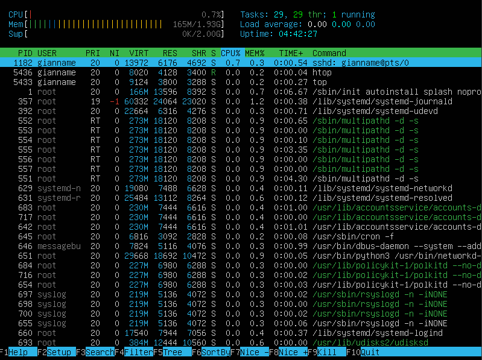

	-Ввывод команды `htop` отсортированному по `PERCENT_MEM`

	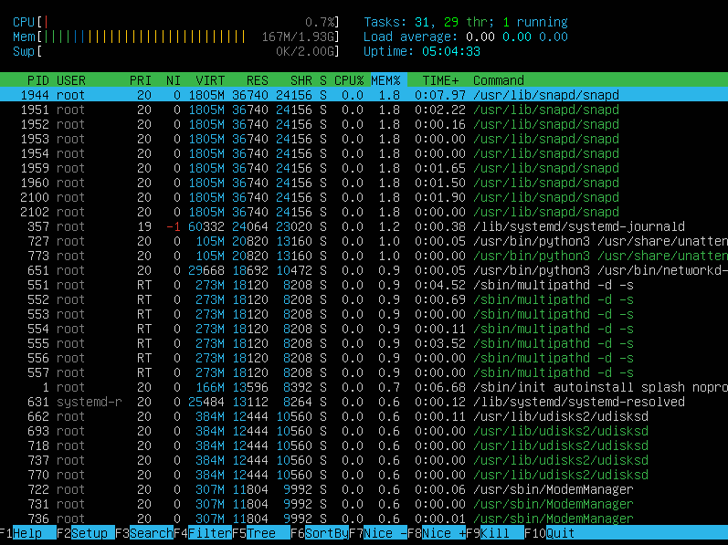

	-Ввывод команды `htop` отсортированному по `TIME`

	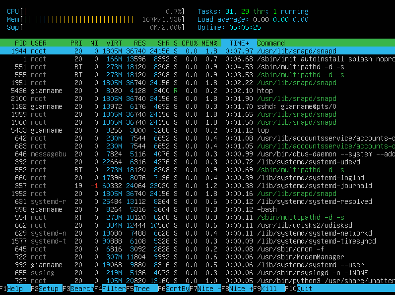

	-Ввывод команды `htop` отфильтрованному по процессу `sshd`

	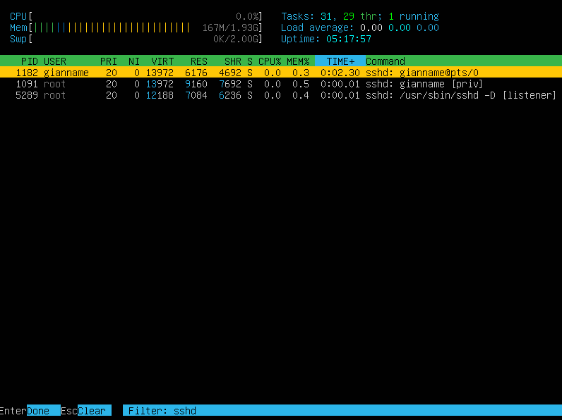

	-Ввывод команды `htop` с процессом `syslog`, найденным, используя поиск

	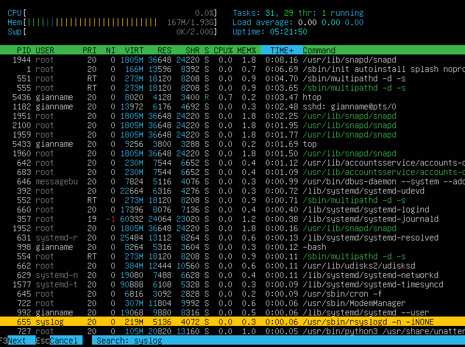

	-Ввывод команды `htop` с добавленным выводом hostname, clock и uptime

	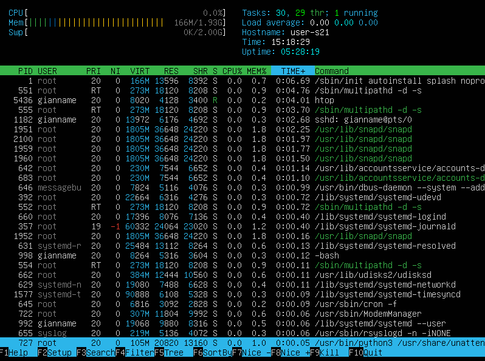

---

## Part 10. Использование утилиты fdisk

- Данные с вывода команды `fdisk -l`:

	- Размер раздела - VBOX HARDDISK
	- Размер  жесткого диска -  25 Gb
	- Количество секторов - 52428800

- Размер swap узнаем командой `swapon --show`- 2Gb
---

## Part 11. Использование утилиты df
- Данные с вывода команды `df /`:

	- Название жесткого диска - 11758760 Kb
	- Размер  занятого пространства -  4954052 Kb
	- Размер  свободного пространства -  6185600 Kb
	- Процент использования - 45%
- Единица измерения в выводе. - 1K-blocks (1Kb)
 

- Данные с вывода команды `df -Th`:

	- Название жесткого диска - 12Gb
	- Размер  занятого пространства -  4.8Gb
	- Размер  свободного пространства -  5.9Gb
	- Процент использования - 45%
- Тип файловой системы - `ext4`
 

---

## Part 12. Использование утилиты du
> Для вывода команды `du` в байтах, используются флаги `-sb`.  
Для вывода команды `du` в еловекочитаемом виде, используются флаги `-sh`.  

- Данные с вывода команды `du -sb /home`:

	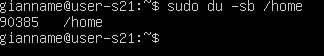

- Данные с вывода команды `du -sh /home`:

	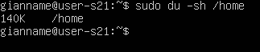

 

- Данные с вывода команды `du -sb /var`:

	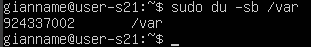

- Данные с вывода команды `du -sh /var`:

	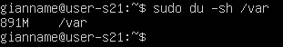

 

- Данные с вывода команды `du -sb /var/log`:

	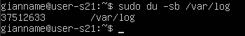

- Данные с вывода команды `du -sh /var/log`:

	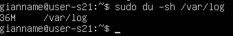

 

- Данные с вывода команды `du -sh /var/log/*`:

	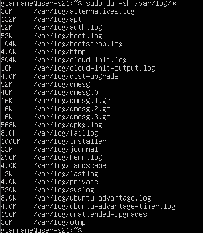

---

## Part 13. Установка и использование утилиты ncdu
>Установим утили `ncdu` командой `sudo apt install ncdu`

- Данные с вывода команды `ncdu /home`:

	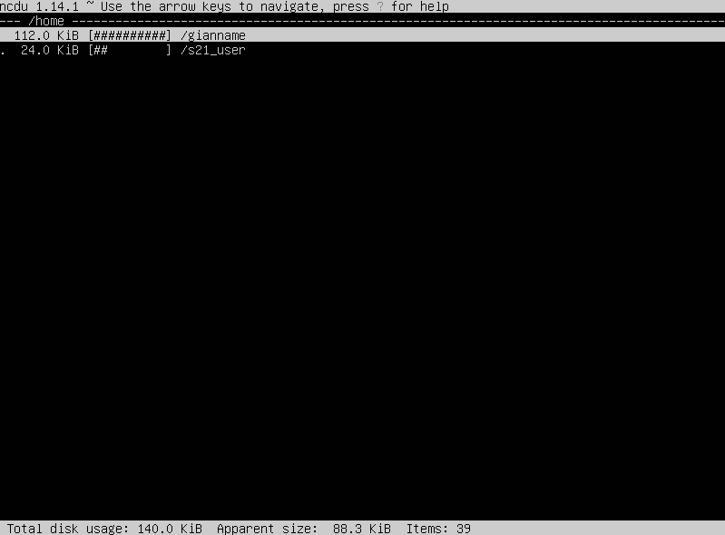

 

- Данные с вывода команды `ncdu /var`:

	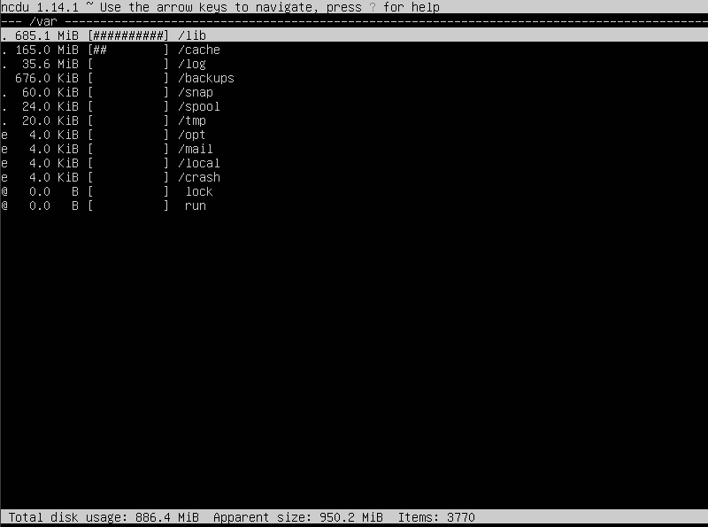

 

- Данные с вывода команды `ncdu /var/log`:

	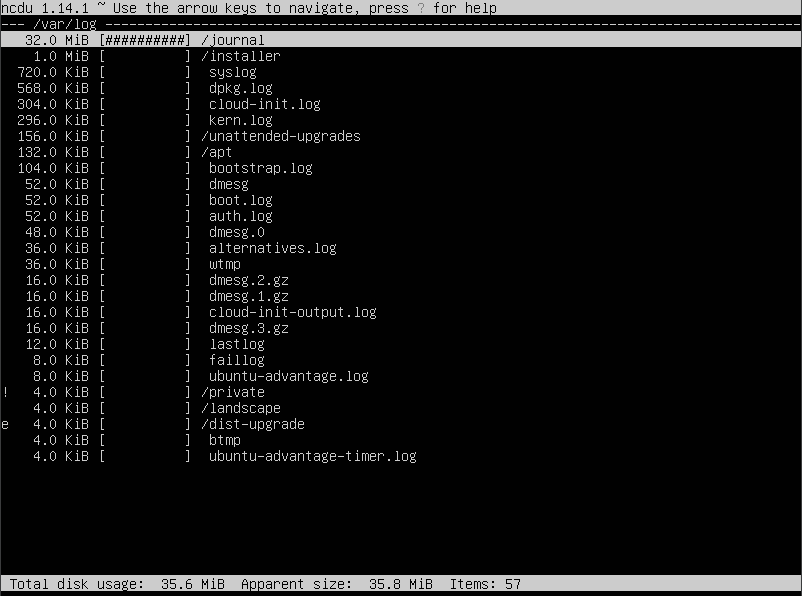

 

---

## Part 14. Работа с системными журналами
- Просмотрим журналы с помощью команд:
`cat /var/log/dmesg`
`cat /var/log/syslog`
`cat /var/log/auth.log`
 

- Последняя успешная авторизация по журналу `auth.log`:
	- Дата и время -  `Jun 15 16:25:18`
	- Имя пользователя - `gianname`
	- Метод входа в систему - `pam_unix(sshd:session)`

- Перезапустим службу SSHd `sudo systemctl restart sshd`.

-Информация о перезапуске службы записана в журнал `/var/log/syslog`

---

## Part 15. Использование планировщика заданий CRON
- Откроем файл планировщика, при помощи команды `crontab -e` добавим в расписание выполнение команды `uptime` каждые 2 мин (`*/2 * * * * uptime`)
- Запуск команды `uptime` по расписанию отражается в журнале `/var/log/syslog`

	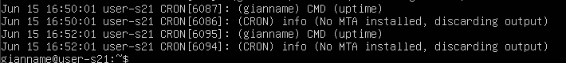

 

- Вывод списка текущих заданий для CRON:

	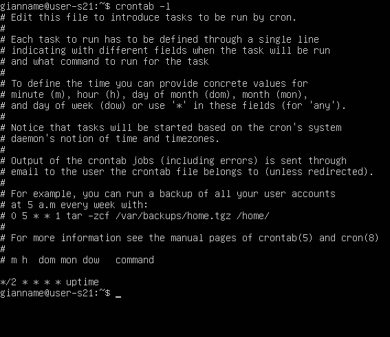

 

- Удаление всех заданий из планировщика заданий `crontab -r`. После удаления ущу раз выводим список текущих заданий:

	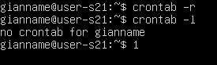

 